# 1. Dynamic Host Configuration Protocol (DHCP)
## 1.1 Konsep Dasar
### 1.1.1 Pengertian

**DHCP (Dynamic Host Configuration Protocol)** adalah protokol yang berbasis arsitektur client/server yang dipakai untuk memudahkan pengalokasian alamat IP dalam satu jaringan. DHCP secara otomatis meminjamkan alamat IP kepada komputer yang memintanya. 


Tanpa DHCP, administrator jaringan harus memasukkan alamat IP masing-masing komputer dalam suatu jaringan secara manual. Namun jika DHCP dipasang di jaringan, maka semua komputer yang tersambung di jaringan akan mendapatkan alamat IP secara otomatis dari DHCP server.

### 1.1.2 Cara Kerja

DHCP bekerja dengan melibatkan dua pihak yakni **Server** dan **Client**: 

1. **DHCP Server** memberikan suatu layanan yang dapat memberikan alamat IP dan parameter lainnya kepada semua client yang memintanya. 
2. **DHCP Client** adalah mesin client yang menjalankan perangkat lunak client yang memungkinkan mereka untuk dapat berkomunikasi dengan DHCP server.

DHCP Server umumnya memiliki sekumpulan alamat IP yang didistribusikan yang disebut **DHCP Pool**. Setiap client akan meminjamnya untuk rentan waktu yang ditentukan oleh DHCP sendiri (dalam konfigurasi). Jika masa waktu habis, maka client akan meminta alamat IP yang baru atau memperpanjangnya. Itulah sebabnya alamat IP client menjadi dinamis.


Terdapat 4 tahapan yang dilakukan dalam proses peminjaman alamat IP pada DHCP:

1. **DHCPDISCOVER**: Client menyebarkan request secara broadcast untuk mencari DHCP Server yang aktif.
2. **DHCPOFFER**: DHCP server menawarkan  alamat IP kepada client. Alamat IP yang ditawarkan adalah salah satu alamat yang tersedia dalam DHCP Pool pada DHCP Server yang bersangkutan.
3. **DHCPREQUEST**: Client menerima tawaran dan menyetujui peminjaman alamat IP tersebut kepada DHCP Server.
4. **DHCPACK**: DHCP server menyetujui permintaan alamat IP dari client dengan mengirimkan paket ACKnoledgment berupa konfirmasi alamat IP dan informasi lain. Kemudian client melakukan inisialisasi dengan mengikat (binding) alamat IP tersebut dan client dapat bekerja pada jaringan tersebut. 

## 1.2 Konfigurasi
### 1.2.1 Instalasi ISC-DHCP-Server
Kita akan menjadikan router **GEBANG** sebagai DHCP Server. Oleh karena itu, install **isc-dhcp-server** di **GEBANG** dengan melakukan langkah-langkah di bawah ini:

1. Update dulu **GEBANG**-nya dengan ```apt-get update```
2. Setelah mengupdate, install **isc-dhcp-server** dengan ```apt-get install isc-dhcp-server```

    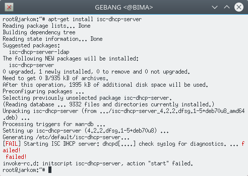

    **Keterangan** : Jangan panik dengan tulisan **[FAIL]**. Coba dibaca baik-baik, itu yang gagal bukanlah proses instalasinya, tetapi proses starting DHCP server-nya. Hal itu terjadi karena kita belum mengkonfigurasi interface-nya. Yuk capcus ke langkah selanjutnya!

### 1.2.2 Konfigurasi DHCP Server
Supaya DHCP Server bisa berjalan dengan baik, kita harus mengkonfigurasi interface-nya terlebih dahulu. Lakukanlah,

1. Buka ```/etc/default/isc-dhcp-server``` untuk mengkonfigurasi interface DHCP
    ```
    nano /etc/default/isc-dhcp-server
    ```
2. Tentukan interface DHCP-nya

    Coba cermati topologi kalian. Interface dari router **GEBANG** yang menuju ke client **NGAGEL**, **NGINDEN**, dan **DARMO** adalah **eth2**, maka kita akan memilih **eth2** sebagai interface DHCP.

    ```
    INTERFACES="eth2"
    ```
    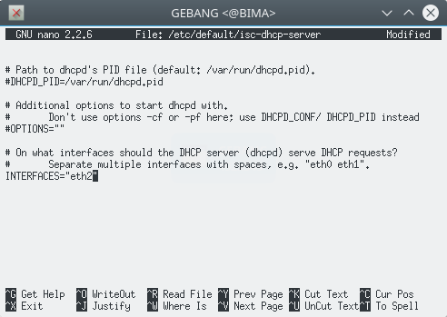

3. Buka ```/etc/dhcp/dhcpd.conf``` untuk mengatur range IP yang akan digunakan dalam DHCP server
    ```
    nano /etc/dhcp/dhcpd.conf
    ```
4. Tambahkan syntax berikut
    ```bash
    subnet 'NID' netmask 'Netmask' {
        range 'IP_Awal' 'IP_Akhir';
        option routers 'Gateway';
        option broadcast-address 'IP_Broadcast';
        option domain-name-servers 'DNS_yang_kalian_inginkan';
        default-lease-time 'Waktu';
        max-lease-time 'Waktu';
    }
    ```
    Selain alamat IP, banyak parameter jaringan yang dapat didistribusikan oleh DHCP, seperti informasi netmask, default gateway dan DNS server. Berikut ini beberapa **parameter jaringan dasar** yang biasanya digunakan adalah:

    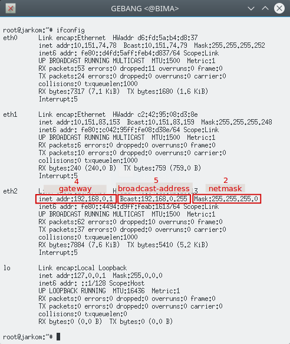

    * **subnet 'NID'**: Network ID pada subnet
    * **netmask 'Netmask'**: Netmask pada subnet
    * **range 'IP_Awal' 'IP_Akhir'**: Rentang alamat IP yang akan didistribusikan dan digunakan secara dinamis
    * **option routers 'Gateway'**: IP gateway dari router menuju client sesuai konfigurasi subnet
    * **option broadcast-address 'IP_Broadcast'**: IP broadcast pada subnet
    * **option domain-name-servers 'DNS_yang_kalian_inginkan'**: DNS yang ingin kita berikan pada client
    * **Lease time**: Waktu yang dialokasikan ketika sebuah IP dipinjamkan kepada komputer client. Setelah waktu pinjam ini selesai, maka IP tersebut dapat dipinjam lagi oleh komputer yang sama atau komputer tersebut mendapatkan alamat IP lain jika alamat IP yang sebelumnya dipinjam, dipergunakan oleh komputer lain.
    * **default-lease-time 'Waktu'**: Lama waktu DHCP server meminjamkan alamat IP kepada client, dalam satuan detik, 600 detik
    * **max-lease-time 'Waktu'**: Waktu maksimal yang di alokasikan untuk peminjaman IP oleh DHCP server ke client dalam satuan detik, 7200 detik.

    Sehingga, konfigurasinya menjadi seperti ini
    ```bash
    subnet 192.168.0.0 netmask 255.255.255.0 {
        range 192.168.0.10 192.168.0.20;
        option routers 192.168.0.1;
        option broadcast-address 192.168.0.255;
        option domain-name-servers 202.46.129.2;
        default-lease-time 600;
        max-lease-time 7200;
    }
    ```
    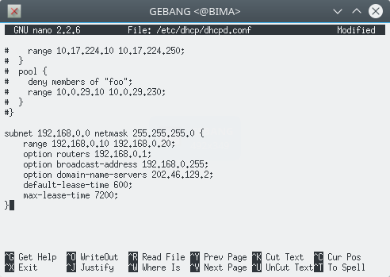


5. Jangan lupa restart!
    ```bash
    service isc-dhcp-server restart
    ```
    Jika **failed**, maka stop dulu, kemudian start kembali
    ```bash
    service isc-dhcp-server stop
    service isc-dhcp-server start
    ```
    

### 1.2.3 Konfigurasi DHCP Client
Kita juga perlu mengkonfigurasi interface client supaya client tersebut mendapatkan IP dinamis dari DHCP server. Client yang akan kita berikan IP dinamis adalah **NGAGEL**, **NGINDEN**, dan **DARMO**. Lakukanlah,

1. Sebelumnya, coba cek terlebih dahulu IP **NGAGEL** dengan ```ifconfig```
    
    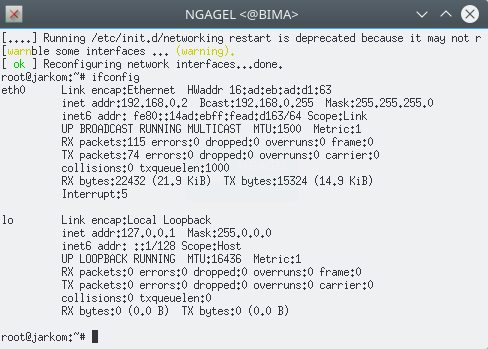

    Dari konfigurasi sebelumnya, IP **NGAGEL** telah di set 192.168.0.2

2. Buka ```/etc/network/interfaces``` untuk mengkonfigurasi interface **NGAGEL**
    ```
    nano /etc/network/interfaces
    ```
3. Comment atau hapus konfigurasi yang lama, kemudian tambahkan syntax ini
    ```
    auto eth0
    iface eth0 inet dhcp
    ```
    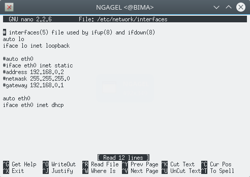

    **Keterangan**: **eth0** adalah interface yang digunakan client.

4. Jangan lupa restart!
    ```bash
    service networking restart
    ```
    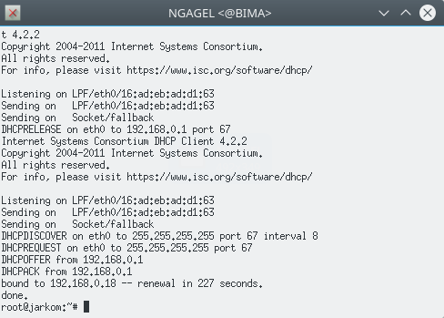

5. Testing

    Coba cek kembali IP **NGAGEL** dengan melakukan ```ifconfig```

    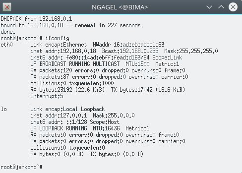

    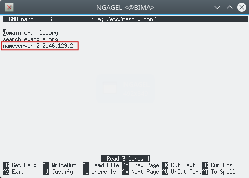

    Yeay! IP **NGAGEL** telah berubah sesuai dengan range IP yang diberikan oleh DHCP Server, serta nameserver-nya otomatis ter-set mengarah ke 202.46.129.2. Berarti DHCP kalian berhasil.

    **Keterangan** : 
    * Jika IP **NGAGEL** masih belum berubah, jangan panik. Lakukanlah kembali ```service networking restart```
    * Jika masih belum berubah juga, jangan buru-buru bertanya. Coba cek lagi semua konfigurasi yang telah kamu lakukan, mungkin ada typo-typo.

Lakukan kembali langkah-langkah di atas pada client **NGINDEN** dan **DARMO**.

## 1.2.4 Fixed Address

Ternyata PC **DARMO** selain menjadi client, juga akan digunakan sebagai server suatu aplikasi, sehingga akan menyulitkan jika IP nya berganti-ganti setiap connect WiFi. Oleh karena itu, **DARMO** membutuhkan IP tetap. Untungnya DHCP Server memiliki layanan untuk "menyewakan" alamat IP pada suatu host, yaitu menggunakan **Fixed Address**. Dalam kasus ini, **DARMO** akan mendapatkan IP tetap 192.168.0.15.

Lakukanlah,

1. Buka konfigurasi DHCP Server di router **GEBANG**
     ```bash
    nano /etc/dhcp/dhcpd.conf
    ```
    dan tambahkan syntax berikut
    ```bash
    host darmo {
        hardware ethernet 'hwaddress_darmo';
        fixed-address 192.168.0.15;
    }
    ```
    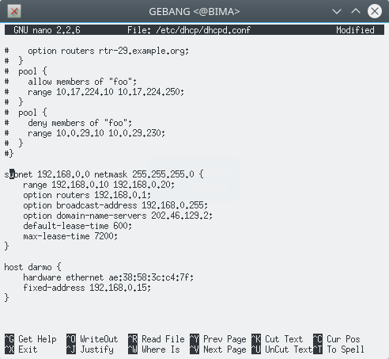

    **Penjelasan:**
    
    * **hardware ethernet** didapatkan dari **hardware address** dari **DARMO**, dengan cara ```ifconfig```

        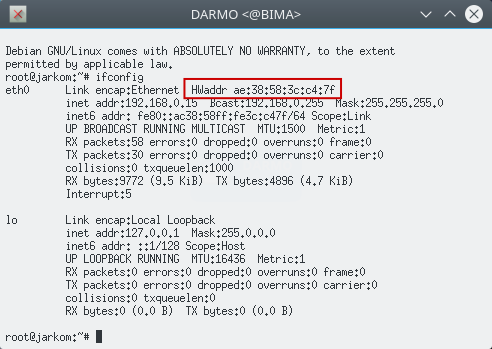

    * **fixed-address** adalah alamat IP yang "disewa" oleh **DARMO**
    
2. Jangan lupa restart!
    ```bash
    service isc-dhcp-server restart
    ```

3.  Buka konfigurasi interface **DARMO**
    ```bash
    nano /etc/network/interfaces
    ```
    Kemudian tambahkan **hardware address DARMO** pada konfigurasi
    ```bash
    hwaddress ether 'hwaddress_darmo'
    ```
    
    

    **Keterangan:** Hardware address perlu di-setting juga di **/etc/network/interfaces** karena perangkat yang kalian gunakan adalah perangkat virtual (UML) dimana hwaddress-nya akan berubah setiap kali di-restart

4. Jangan lupa restart!
    ```bash
    service networking restart
    ```
    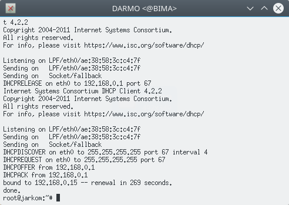

5. Testing

    Coba cek IP **DARMO** dengan melakukan ```ifconfig```

    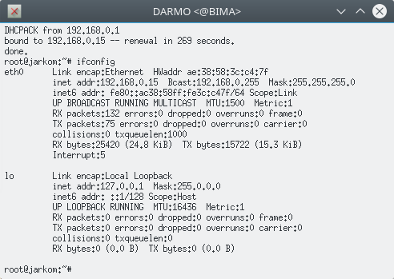

    Yeay! IP **DARMO** telah berubah menjadi 192.168.0.15 sesuai dengan Fixed Address yang diberikan oleh DHCP Server.

## 1.2.5 Final Testing

Setelah melakukan berbagai konfigurasi di atas, kalian bisa memastikan apakah DHCP Server kalian berhasil dengan cara

1. Matikan UML kalian

    ```bash
    bash bye.sh
    ```
2. Jalankan UML kembali 

    ```bash
    bash topologi.sh
    ```
3. Cek IP di semua client dengan ```ifconfig```

Jika **NGAGEL** dan **NGINDEN** berganti alamat IP dan **DARMO** tetap mendapatkan IP 192.168.0.15, maka DHCP server kalian berhasil dengan baik. 

## 1.3 Soal Latihan
1. Buatlah konfigurasi DHCP agar NGAGEL dan NGINDEN mendapatkan IP dengan range 192.168.0.1 - 192.168.0.10 dan 192.168.0.12 - 192.168.0.16 dengan syarat:
    * Setiap 1 menit IP yang digunakan client berganti
    * DNS mengarah ke DNS server kalian sendiri yaitu KLAMPIS, tetapi tetap bisa digunakan untuk mengakses internet
